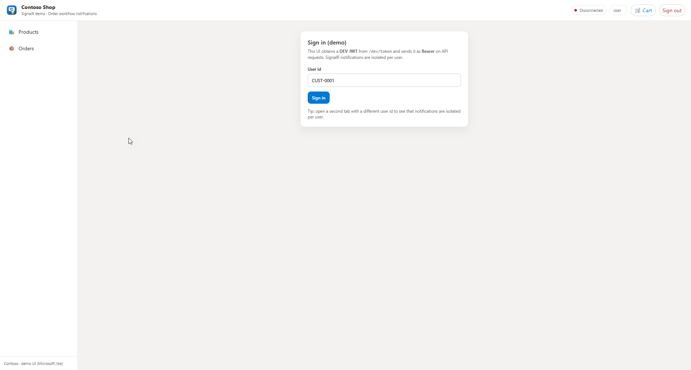
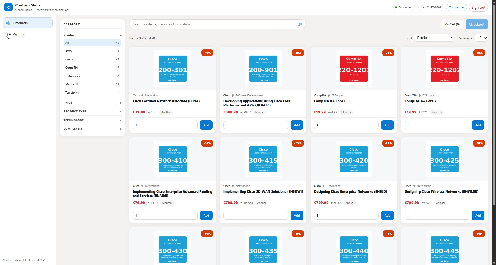
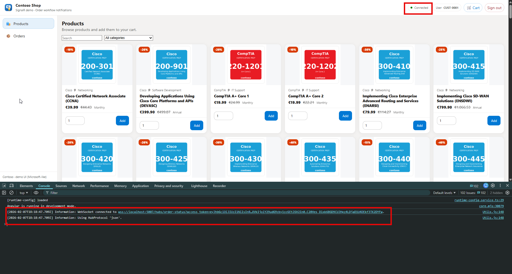
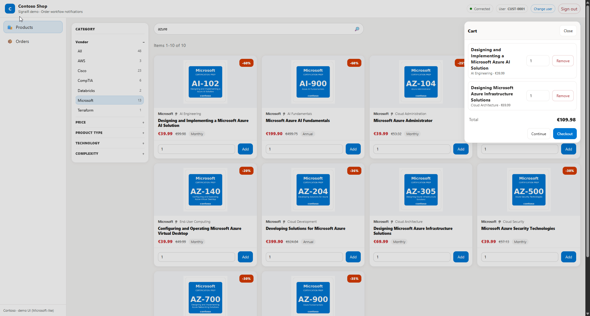
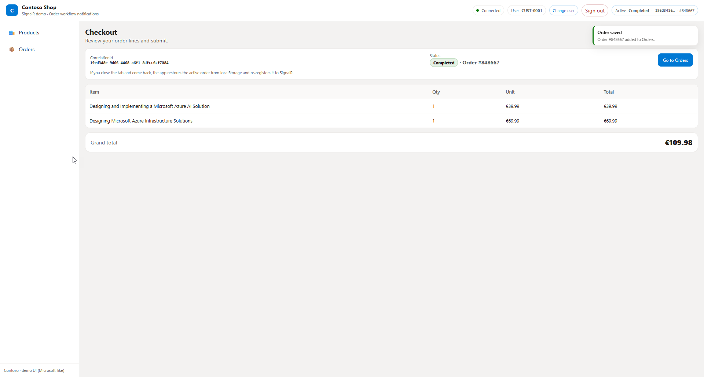
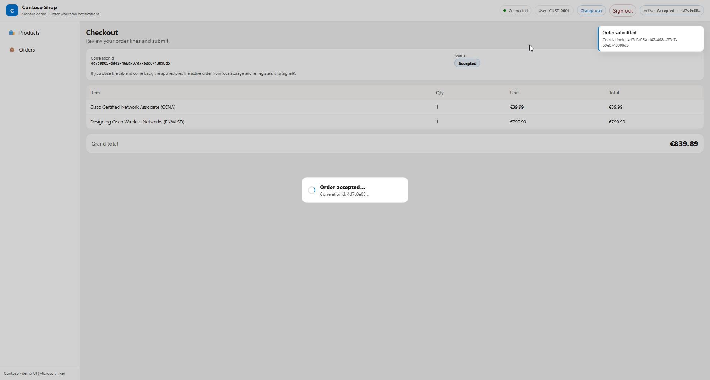
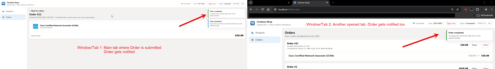

[](https://github.com/ivantorres89/event-driven-microservices-orders/actions/workflows/ci.yml)
[](https://github.com/ivantorres89/event-driven-microservices-orders/tree/badges)
# Contoso Shop— Event-Driven Order Processing Microservices (Azure)

## The shop

**Contoso Shop** is a fictional, training e-commerce that sells **certification-prep content** (practice exams, labs, and study guides) as **digital subscriptions**.

The target customers range from individual learners to corporate training teams purchasing seats in bulk. Purchases are **business-critical**: once a payment is accepted, the platform must reliably provision entitlements, persist the order history, and keep the learner informed—without double-processing or losing track of status during refreshes or reconnects.

This demo seeds a catalog of **145 certification-prep subscriptions** across multiple vendors (e.g., Microsoft, Cisco, AWS, CompTIA). Users can browse/search, build a cart, submit an order, and track the lifecycle **Accepted → Processing → Completed** with **real-time notifications**.

To see the full workflow please do read: [Workflow full documentation](WORKFLOW.md)

To see full OpenAPI specifications please do check:
[YAML OpenAPI Spec](/services/order-accept/apispecs/openapi.yaml)
[API & interfaces fully explained](/services/order-accept/apispecs/order-accept_api_contract.md)

## Local development (Docker Compose + HTTPS)


**Recommended (least environment‑dependent):**

1) Export the dev HTTPS certificate for Docker *(once per machine)*  
- macOS/Linux: `./infra/local/ensure-devcert.sh`  
- Windows (PowerShell): `./infra/local/ensure-devcert.ps1`

2) Trust the dev certificate *(once per machine)*  
```bash
dotnet dev-certs https --trust
```

3) Start / stop the full stack  
```bash
docker compose up -d --build
# ...
docker compose down
```

Useful URLs:
- SPA: `http://localhost:4200`
- order-notification HTTPS: `https://localhost:5007` (SignalR hub: `/hubs/order-status` via WSS)
- RabbitMQ UI: `http://localhost:15672`
- Jaeger UI: `http://localhost:16686`


[For details & troubleshooting:](/infra/local/README.md)

---

## Some screenshots

<table>
  <tr>
    <td align="center" valign="top">
      
      <br/>
      <sub><b>login</b></sub>
    </td>
    <td align="center" valign="top">
      
      <br/>
      <sub><b>products</b></sub>
    </td>
    <td align="center" valign="top">
      
      <br/>
      <sub><b>websockets connected</b></sub>
    </td>
    <td align="center" valign="top">
      
      <br/>
      <sub><b>cart</b></sub>
    </td>
  </tr>
  <tr>
    <td align="center" valign="top">
      
      <br/>
      <sub><b>checkout</b></sub>
    </td>
    <td align="center" valign="top">
      
      <br/>
      <sub><b>order accepted</b></sub>
    </td>
    <td align="center" valign="top">
      
      <br/>
      <sub><b>order completed</b></sub>
    </td>
    <td align="center" valign="top">
      
      <br/>
      <sub><b>wss multitab</b></sub>
    </td>
  </tr>
</table>

---

## Overview

This repository showcases an **event-driven, asynchronous microservices system** designed to process orders at scale while providing **real-time user notifications**.

The project is intended as a **technical portfolio**, demonstrating:

- Backend microservices design
- Event-driven and asynchronous workflows
- Messaging-based integration
- Real-time communication using WebSockets
- Clean service boundaries and stateless services
- Observability concerns (logging, metrics, tracing) are implemented at service boundaries to support debugging and distributed traceability.

The implementation is inspired by **real-world cloud-native architectures**, focusing on **system behavior, responsibilities, and interactions** rather than production hardening.


## Architecture Context


This repository contains the **implementation** of an event‑driven order workflow. The diagram above reflects the **cloud reference architecture** (AKS + Service Bus + Azure SQL + Redis + WebSockets), while the repo ships a **local equivalent** via Docker Compose.

**Cloud reference (conceptual):**
- **Edge & security:** Azure API Management (JWT validation, throttling) + AKS Ingress (NGINX) for L7 HTTPS routing.
- **Compute:** AKS running three independently scalable microservices.
- **Messaging:** Azure Service Bus queues (FIFO semantics) for `order.accepted` and `order.processed`.
- **State:** Azure SQL Database as the **System of Record** (orders, items, history).
- **Real‑time:** SignalR (self‑hosted) + **Redis backplane** for multi‑pod fan‑out and session resolution.
- **Observability:** correlationId propagated across logs/traces (OpenTelemetry) for end‑to‑end debugging.

**Local dev (this repo):**
- Service Bus → **RabbitMQ** (no Service Bus emulator)
- Azure SQL → **SQL Server**
- Azure Cache for Redis → **Redis**
- Optional: **OpenTelemetry Collector + Jaeger** for distributed tracing

If you want the full case‑study context (requirements, trade‑offs, and design rationale), see the companion repository:

-> **Azure Architecture Solutions (case study: k8s-websockets-apporders)**  
https://github.com/ivantorres89/azure-architecture-solutions/tree/main/case-studies/k8s-websockets-apporders

## Problem Statement

The system models a simplified order processing platform with the following constraints:

- Orders must be accepted quickly without blocking the user
- Backend processing is fully asynchronous
- The system must tolerate retries and transient failures
- Users must be notified in real time once processing completes
- Services must remain stateless and independently scalable

---

## High-Level Workflow


This system is **asynchronous by design**: the HTTP request is accepted fast, and the heavy work happens in background consumers.

### Identifiers used end‑to‑end
- **userId**: derived from the JWT (`sub`) and used to route WebSocket notifications (`Clients.User(userId)`).
- **correlationId (UUID)**: generated at intake to correlate the async workflow across logs/traces.
- **orderId**: business identifier (SQL PK) owned by the persistence workflow (created during processing).

### Flow (happy path)
0) **SPA opens WSS (SignalR)** and keeps a persistent connection for real‑time updates.  
1) **SPA → `order-accept` (HTTP `POST /api/orders`)**
   - Validates JWT, extracts **userId**
   - Generates **correlationId**
   - Writes ephemeral operational state to Redis (TTL):
     - `order:map:{correlationId} = {userId}`
     - `order:status:{correlationId} = ACCEPTED`
   - Publishes `order.accepted` to the broker (**no userId in the message**)
   - Returns **201** quickly (with correlationId and the business id used by the workflow)
2) **`order-process` consumes `order.accepted`**
   - Sets `order:status:{correlationId} = PROCESSING` and **refreshes TTLs** to avoid expiry during long work
   - Persists the **Order + Items** in SQL (**System of Record**)
   - Publishes `order.processed(correlationId, orderId)`
   - Sets `order:status:{correlationId} = COMPLETED` (TTL refreshed)
3) **`order-notification` consumes `order.processed`**
   - Resolves `userId` via `GET order:map:{correlationId}` (with **short retries** for races)
   - Sets serialized message containing {correlationId} on Redis Pub/Sub channel contoso-signalrOrderNotification to notify all pods the order was completed succesfully.
   - Every pod pushes a WebSocket message to the user via `Clients.User(userId)`

### Redis backplane resilience (what happens when things go wrong)
- **Redis mapping missing** (`order:map:{cid}` not found): `order-notification` retries briefly; if still missing it **does not ACK** the message so the broker can retry and eventually route to **DLQ** (no silent loss).
- **Long processing times:** `order-process` **refreshes TTLs** to prevent correlation/session mappings from expiring mid‑workflow.
- **Multi‑replica SignalR:** SignalR uses Redis **pub/sub backplane** so `Clients.User(userId)` reaches all active connections across pods. If the backplane is unavailable, cross‑pod fan‑out is degraded, but WebSocket connections remain independent of the consumer path.

## Services Overview

This repository contains **three backend microservices** and a **lightweight frontend application** used to visualize the full end-to-end flow.

### 1. Order Accept Service

- HTTP API for order intake (CRUD-style)
- Generates a `CorrelationId`
- Publishes messages to the order queue
- Performs no synchronous business processing

### 2. Order Process Service

- Background worker service
- Consumes messages asynchronously
- Performs idempotent processing
- Persists orders and emits completion events

#### Persistence Responsibility
- This service owns the relational database schema and is responsible for:
- Schema creation and migrations
- Persisting business entities
- Emitting domain events after successful persistence

### 3. Order Notification Service

- WebSocket server
- Manages client connections
- Uses a Redis backplane for session resolution
- Pushes real-time notifications when orders are completed

### 4. Frontend Application (SPA)

- Minimal Single Page Application
- Allows submitting orders and receiving real-time updates
- Communicates via HTTP and WebSockets
- Exists purely to **demonstrate system behavior**
- Not intended as a production-grade frontend

The frontend is deliberately kept **simple**, as the focus of this repository is backend architecture and distributed systems design.

---

## Messaging Infrastructure

This system is designed around **asynchronous, message-based communication**.

- **Azure Service Bus** is used in production environments.
- Azure Service Bus does not provide a local development emulator.
- For local development and validation, a **RabbitMQ broker** is provisioned via Docker.

The application code depends exclusively on **messaging abstractions**.
The underlying broker can be replaced without affecting business logic.

RabbitMQ is used **only** for local development and integration testing purposes.

---

## Repository Structure


This is a **monorepo** for ease of exploration (in production, services are often split into separate repos).

- `docker-compose.yml` — local stack (services + infra)
- `infra/local/` — dev certificates and local infra helpers
- `design/` — architecture diagram(s)
- `docs/` — screenshots and supporting material
- `frontend/` — demo SPA (Angular)

**Microservices (each one ships its own `README.md`, `Dockerfile`, and tests):**
- `services/order-accept/` — HTTP API (intake) + publish `order.accepted`
- `services/order-process/` — background consumer + SQL persistence + publish `order.processed`
- `services/order-notification/` — SignalR hub + consume `order.processed` + Redis backplane/session resolution

**Messaging abstraction note:** code targets interfaces so the broker can be swapped (RabbitMQ locally, Service Bus in cloud).

## Testing Strategy


This repository applies a **layered testing approach**:

### Unit Tests
- Validate service behavior in isolation
- Focus on domain logic, request validation, and error handling
- External dependencies are mocked via abstractions

### Integration Tests
Integration tests are intentionally **limited in scope** and focus on validating:

- HTTP request handling at service boundaries
- REDIS Operations: GET, SET, DEL.
- Message publishing and consumption behavior
- Messaging contracts and serialization
- Interaction with a real message broker

Integration tests **do not** cover:
- Frontend behavior
- End-to-end user workflows
- Cloud infrastructure provisioning
- Azure-managed services

Their purpose is to validate **service contracts and distributed behavior**, not infrastructure correctness.

---

## Identity and Authentication


Authentication is assumed to be handled by an external Identity Provider (IdP).

- OAuth 2.0 / OpenID Connect
- JWT-based access tokens
- Standard claims (issuer, audience, subject)

The Identity Provider itself is out of scope for this project.

> **Dev convenience:** in local/dev, `order-notification` exposes `POST /dev/token` to mint a JWT for the demo.
> In test/staging/prod, the token must come from an **external IdP** (OIDC/OAuth2) and the `/dev/token` endpoint is not used.

The system is designed to remain IdP-agnostic, allowing integration with any standards-compliant provider
(e.g. Azure AD, Keycloak, Auth0).

## Scope and Intent

This repository focuses on:

- Service boundaries
- Communication patterns
- Asynchronous workflows
- Event-driven behavior

The following concerns are intentionally out of scope:

- Production-grade infrastructure sizing
- Advanced Kubernetes topology
- CI/CD pipelines
- Cloud cost optimization
- Those topics are addressed at the architecture level in the companion repository.


## Disclaimer

This repository is provided for portfolio and educational review purposes only.

The code and architecture examples:

- Are not production-ready
- Must not be reused, redistributed, or deployed in real environments
- Do not represent any real customer or system


---

