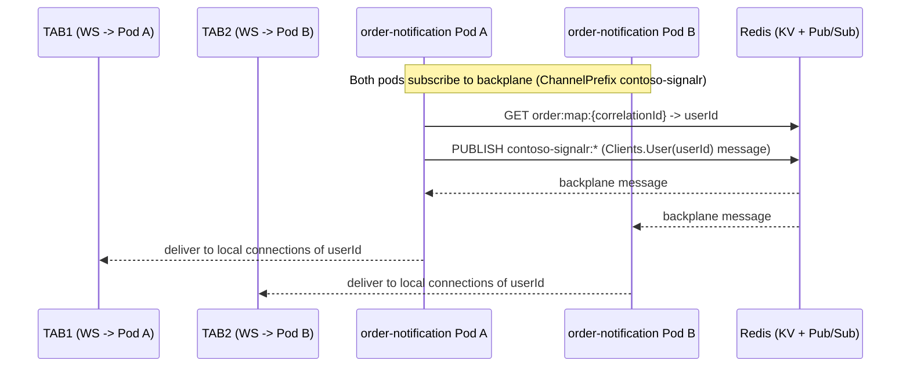

# Contoso Shop — SignalR scale-out with Redis backplane (no sticky sessions)

# Case 1 — Happy path: low load, user has 1 tab

**Cluster state**
- HPA min=2 ⇒ at least **Pod A** and **Pod B** exist
- Low load: stays at 2 pods

## Step-by-step flow

### 1) TAB1 opens the SPA
- Angular starts SignalR:
  - `WebSockets + skipNegotiation`
- The WebSocket is established via Ingress → Service → chosen pod (e.g. **Pod A**)

### 2) User checks out
- SPA sends `POST /api/orders` to `order-accept` with JWT.
- `order-accept`:
  - generates `correlationId`
  - persists to SQL
  - writes to Redis:
    - `SETEX order:map:{correlationId} = userId`
    - `SETEX order:status:{correlationId} = ACCEPTED`
  - emits `order.accepted` (no PII)

### 3) Backend processes and notifies
- `order-process` consumes `order.accepted`
  - updates `order:status:{correlationId}`
- `order-notification` consumes `order.processed(correlationId, orderId)`
  - `GET order:map:{correlationId} -> userId`
  - `Clients.User(userId).SendAsync("OrderCompleted", ...)`

### 4) Redis backplane
- The pod executing the handler publishes to Redis pub/sub (ChannelPrefix `contoso-signalr`)
- Pods A and B receive the message; only Pod A has a local connection for this user → it delivers it.

**Outcome**
- TAB1 receives the toast / update immediately.

---

# Case 2 — Low load, only 2 pods, user opens 2 different tabs and each lands on a different pod

**Cluster state**
- 2 ready pods: **Pod A**, **Pod B**

## Step-by-step flow

### 1) TAB1 connects
- WebSocket (skipNegotiation) → selected **Pod A**

### 2) TAB2 connects
- A second independent WebSocket
- Service/Ingress selects **Pod B**

### 3) An `order.processed(...)` event arrives
- (It does not matter whether Pod A or Pod B consumes it)
- The consumer pod resolves `userId` from Redis (`order:map:{correlationId}`)
- It calls `Clients.User(userId)...`

### 4) Backplane fan-out
- The consumer pod publishes to Redis pub/sub (with `ChannelPrefix`)
- **Both pods** (A and B) receive the backplane message
- Each delivers to its local connections for that `userId`:
  - Pod A → TAB1
  - Pod B → TAB2

**Outcome**
- **Both tabs are notified**, even though they are connected to different pods.

---

# Case 3 — High traffic: HPA scales out up to 4 pods

**Cluster state**
- HPA scales from 2 → 4 pods:
  - **Pod A**, **Pod B**, **Pod C**, **Pod D**
- New pods become “ready” after passing readiness probes.

## Is there load balancing? Which pod does a new tab connect to?

When the user opens a new tab:
1) A **new WebSocket** is created (new TCP connection)
2) Ingress/Service selects a ready endpoint:
   - typically spreads across A/B/C/D

**Important**
- Existing WebSockets are not moved between pods.
- Tabs already connected remain on their original pods.
- New tabs tend to distribute across ready pods.

## Notifications with 4 pods
- Any pod may consume `order.processed(...)`
- The pod calling `Clients.User(userId)` publishes to Redis pub/sub
- All 4 pods receive the backplane message and deliver only to their own local connections for that user.

**Outcome**
- Notifications remain consistent even when many tabs are spread across many pods.

---

# Case 4 — Traffic drops: HPA scales in from 3 pods to 2 pods (TAB2’s pod gets terminated)

**Initial state**
- 3 ready pods: **Pod A**, **Pod B**, **Pod C**
- TAB1 is connected to **Pod A**
- TAB2 is connected to **Pod C**
- HPA decides to scale in and remove **Pod C** (min=2 ensures 2 pods remain)

## What happens exactly (low level)

### 1) Kubernetes marks Pod C for termination
- Pod C enters **Terminating**
- `preStop` runs:
  - marks draining (e.g. `touch /tmp/draining`)
  - waits `sleep 15`

### 2) Readiness fails on Pod C
- `/health/ready` returns “not ready” while draining
- Kubernetes removes Pod C from ready endpoints
- Ingress/Service stop routing **new connections** to Pod C

> This does not move TAB2 automatically; TAB2 already has an open WebSocket to Pod C.

### 3) TAB2’s WebSocket is closed
- At the end of the grace period (or earlier if the process exits), the container stops
- TAB2’s WebSocket is severed
- TAB2 detects disconnect

### 4) TAB2 reconnects
- `withAutomaticReconnect()` triggers reconnection
- With WebSockets-only + skipNegotiation:
  - the client creates a new WebSocket
  - Ingress/Service selects a ready endpoint (Pod A or Pod B)
- TAB2 is now connected to Pod A or Pod B (Pod C is gone / not ready)

### 5) State rehydration after reconnect
On `onreconnected()` the client:
- re-registers the active correlation (if applicable)
- requests the current status (`GetCurrentStatus`)
- UI catches up even if a transient toast occurred during the brief disconnect window

## Do we lose notifications?
- During the exact interval while TAB2 is disconnected, a push message cannot be delivered to that socket.
- Your design mitigates this because:
  - the UI can re-query status (`GetCurrentStatus`)
  - `order:status:{correlationId}` lives in Redis with TTL

**Outcome**
- TAB1 is unaffected (its pod remains).
- TAB2 reconnects to another pod and continues receiving notifications.

---

## 6) Quick summary of guarantees

**No sticky sessions**
- WebSockets-only + skipNegotiation eliminates negotiate/upgrade mismatch.

**Multi-tab, multi-pod**
- Redis backplane fan-out ensures delivery across pods.

**Scale-out**
- New tabs are distributed across ready pods; existing sockets remain pinned.

**Scale-in**
- Draining prevents new connections to terminating pods.
- Existing sockets close; clients reconnect automatically.
- UI rehydrates status.

---

## 7) Conceptual diagram

---

## 8) Implementation checklist (what was done)

- Server:
  - `AddSignalR().AddStackExchangeRedis(redisConn, o => o.Configuration.ChannelPrefix = "contoso-signalr")`
  - SignalR `UserIdentifier` from JWT `sub`
  - Health endpoints: `/health/live`, `/health/ready`
  - Scale-in draining: readiness fails while draining
- K8s:
  - Dedicated `Service` for `order-notification`
  - Ingress route `/hubs/order-status` → `order-notification`
  - NGINX WebSocket timeouts for long-lived connections
  - `preStop`, `terminationGracePeriodSeconds`, readiness/liveness probes
- Frontend:
  - WebSockets-only + `skipNegotiation: true`
  - Automatic reconnect + state rehydration
