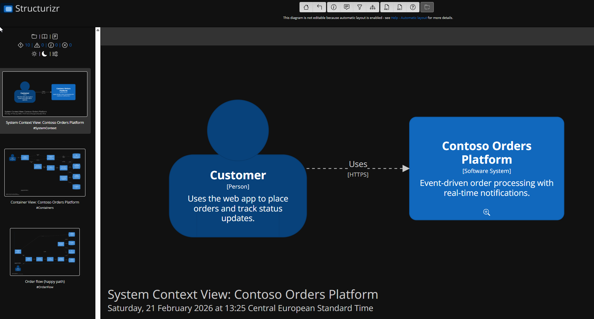
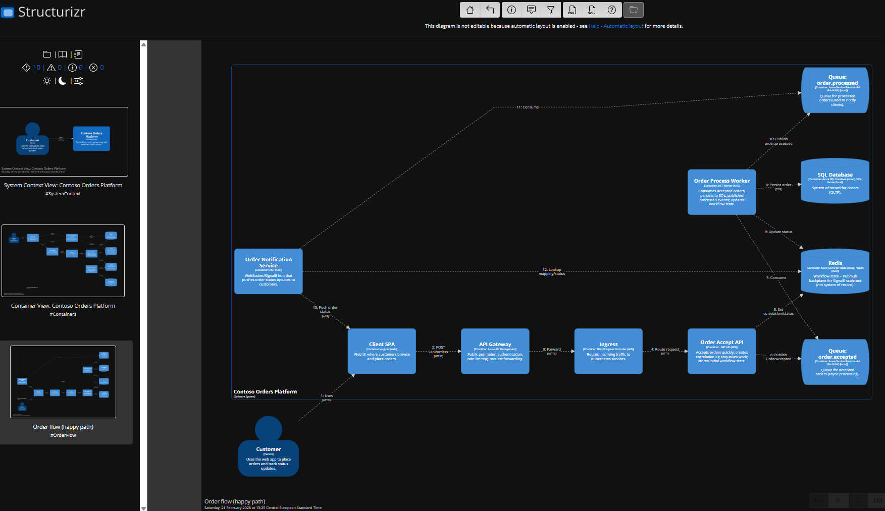
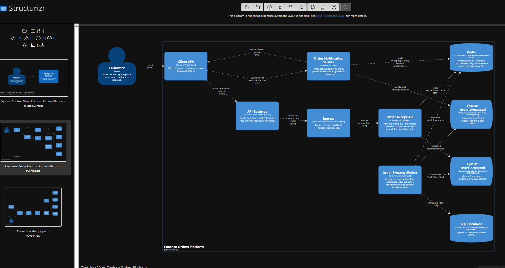

# Structurizr DSL (C4) — Living Architecture prototype (FIXED)

This version fixes PowerShell/Docker volume usage and a DSL scoping issue.

## How to view locally (Structurizr Lite + Docker) — PowerShell

From the repository root, run:

Command prompt:

```command prompt
docker pull structurizr/lite
docker run -it --rm -p 8080:8080 -v "%cd%\architecture\structurizr:/usr/local/structurizr" structurizr/lite
```

Powershell:

```powershell
docker pull structurizr/lite
docker run -it --rm -p 8080:8080 -v "${PWD}/architecture/structurizr:/usr/local/structurizr" structurizr/lite
```

Then open:
- http://localhost:8080

If you are using CMD instead:

```cmd
docker run -it --rm -p 8080:8080 -v "%cd%\architecture\structurizr:/usr/local/structurizr" structurizr/lite
```

## Screenshots

Context:



Happy Path:



Containers:


