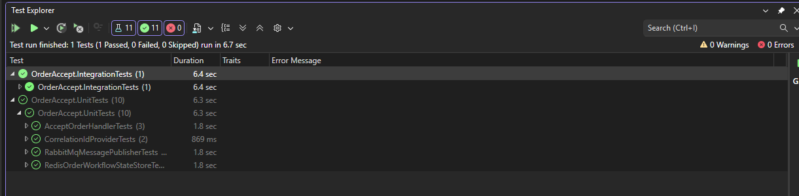

# Order Accept Service

## Purpose

The **Order Accept Service** is the **entry point** of the order processing platform.

Its responsibility is to **accept incoming order requests quickly and safely**, generate a technical identifier for correlation, and **publish the request to the asynchronous processing pipeline**.

This service is intentionally **thin** and performs **no synchronous business processing**.

---

## Responsibilities

This service is responsible for:

- Exposing an HTTP API for order submission
- Validating incoming requests at a basic level
- Generating a **CorrelationId** for end-to-end workflow tracking
- Initializing transient workflow state in **Redis** (`ACCEPTED`) for real-time status tracking
- Publishing an `OrderAccepted` integration event to the message broker
- Returning an immediate response to the client

This service does **not**:

- Persist business data
- Perform business processing logic
- Interact with the relational database
- Block waiting for downstream processing or notifications

---

## Architectural Role

The Order Accept Service acts as a **boundary between synchronous client traffic and asynchronous backend processing**.

By publishing an event and returning immediately, it ensures:

- Low latency for client requests
- Protection of backend systems from traffic spikes
- Loose coupling between ingestion and processing layers

This design follows event-driven architecture principles and supports horizontal scalability.

---

## Workflow Overview

1. A client submits an order via HTTP.
2. The service validates the request.
3. A **CorrelationId** is generated.
4. A transient workflow state is initialized in Redis: `order:status:{CorrelationId} = ACCEPTED` (TTL-based).
5. An `OrderAccepted` event is published to the message broker.
6. The service responds immediately to the client.

The client does **not** wait for order processing to complete.

---

## Correlation Model

This service generates the **CorrelationId**, which is used to:

- Track the order across asynchronous components
- Correlate logs and traces end-to-end
- Link backend processing with WebSocket notifications

The business identifier (`OrderId`) is intentionally **not generated here**.

| Identifier     | Purpose                         |
|----------------|---------------------------------|
| CorrelationId  | Technical workflow correlation  |
| OrderId        | Generated later by the database |

---

## Workflow State (Redis)

To support real-time notifications and reconnection scenarios, this service initializes
a short-lived workflow state in **Redis**.

- On successful acceptance, it sets: `order:status:{CorrelationId} = ACCEPTED`
- The state is **TTL-based** and treated as **ephemeral**
- Redis is not a system of record; the authoritative business state remains in SQL

This enables the notification service to report current status even if the client reconnects.

---

## Communication Contracts

This service defines and owns the following public contracts:

- **HTTP Contracts**
  - Request/response DTOs exposed via the API
  - Versioned and documented through **OpenAPI**

- **Integration Events**
  - Events published to the messaging infrastructure
  - Consumed by downstream services for asynchronous processing

Contracts are treated as **public interfaces** and evolve in a backward-compatible manner.

---

## HTTP API

### `POST /api/orders/accept`

Accepts an incoming order request and immediately enqueues it for asynchronous processing.

This endpoint is intentionally **non-blocking**: it does not persist business data or wait for downstream processing to complete.

#### Request

**Headers**
- `Content-Type: application/json`

**Body**

{
  "customerId": "customer-123",
  "items": [
    { "productId": "product-abc", "quantity": 2 }
  ]
}

#### Response

- Success — 202 Accepted

The service generates a CorrelationId and returns it immediately.

#### Headers

X-Correlation-Id: <uuid>

#### Body

{
  "correlationId": "b2cdbb90-3efc-4a79-b095-3d3d2b8c2ce2"
}

#### Error responses
- 400 Bad Request
- 503 Service Unavailable

---

## Messaging

- Publishes messages to a **FIFO message queue**
- **Azure Service Bus** is used in production
- A local broker (**RabbitMQ**) is used for development and integration testing

Message delivery is **at-least-once**. Downstream consumers are expected to be **idempotent**.

This service does not subscribe to any messages.

---

## Design and Code Organization

This service follows **Clean Architecture** principles:

- The API layer depends on abstractions, not implementations
- Use cases are isolated from infrastructure concerns
- External dependencies (messaging, logging) are injected via interfaces

The codebase adheres to **SOLID principles** to ensure:

- Testability
- Clear separation of responsibilities
- Ease of change without cascading impact

---

## Domain Model

The Order Accept Service applies **Domain-Driven Design** at a lightweight level.

- It defines clear domain contracts for incoming orders
- No business rules or invariants are enforced here
- The domain is intentionally minimal, as this service acts only as an ingestion boundary

Core business logic is deferred to downstream processing services.

---

## Stateless Design

The Order Accept Service is fully **stateless**:

- No in-memory session state
- No persistence of business data
- No dependency on downstream availability for request handling

This allows:

- Horizontal scaling
- Safe retries
- Resilience to partial outages

---

## Security and Authorization

This service does not perform authentication or authorization directly.

Security responsibilities are handled at the **API Gateway layer**, including:

- JWT validation
- Token issuer and audience verification
- Rate limiting and traffic protection

The service trusts forwarded identity claims and operates under a zero-trust internal model.

Authorization decisions, if required, are based on claims propagated from the gateway.

---

## Failure Handling

- If message publishing fails, the request is rejected
- No partial business state is created
- Clients may safely retry requests

Basic resiliency mechanisms such as timeouts and circuit breaking
are applied around external infrastructure dependencies to prevent resource exhaustion.

---

## Resilience

---

## Resilience

This service relies on critical external infrastructure to maintain traceability and operate the workflow:

- **Redis**: required to record the workflow's transient state (`ACCEPTED`) and enable downstream traceability.
- **Message broker (RabbitMQ on-premises / Azure Service Bus in production)**: required to publish the `OrderAccepted` event.

### Applied Policy (Polly)
#### RabbitMQ (publisher)
- **Short timeouts** per attempt to avoid blocked threads.
- **Retries**: 3 retries with backoff (200ms, 500ms, 1s).
- **Publisher Confirms** enabled to increase publishing guarantees.
- If the service fails to publish after retries, the broker is considered unavailable and the request is **rejected** (HTTP **503**).

#### Redis (Workflow State)
- Short timeouts per attempt.
- Retries: 2 retries with backoff (transients only).
- Circuit breaker (fail-fast) to prevent Redis from becoming overloaded in case of degradation.
- Redis is critical: if the transient state cannot be persisted, the request is rejected (HTTP 503).

### HTTP Error Handling
- `DependencyUnavailableException` is caught in middleware and a 503 Service Unavailable error is returned with a standard JSON payload.

> Note: Outbox is not implemented in this microservice. The current strategy is fail-fast to maintain consistency and traceability.

## API Documentation (OpenAPI)

In development and test environments, this service exposes an interactive **Swagger UI**
to facilitate exploration and validation of the HTTP API.

- The API contract is defined using **OpenAPI**
- Swagger UI is enabled only in non-production environments
- The OpenAPI specification can be used for:
  - Manual testing
  - Contract validation
  - Client generation
  - Integration with API gateways

In production environments, the service relies on the API Gateway
as the primary interface and governance layer.

---

## Observability

### Logging

The service uses **structured logging** with correlation-aware context.

- Logs are emitted using the standard .NET logging abstractions
- The `CorrelationId` is included in log scopes for end-to-end traceability
- Logs are designed to be consumed by centralized logging platforms

Logging focuses on **diagnostic value**, not verbose tracing of normal execution paths.

### Telemetry and Tracing

The service emits telemetry using **OpenTelemetry** standards.

- Distributed traces propagate the `CorrelationId` across service boundaries
- Metrics and traces are emitted in a vendor-neutral format
- Telemetry data can be consumed by multiple backends (e.g. Azure Monitor, Grafana)

Observability focuses on **system behavior and flow tracking**, not on low-level infrastructure metrics.

---

## Health Checks

This service exposes basic health check endpoints for container orchestration platforms.

- **Liveness**: indicates whether the service process is running
- **Readiness**: indicates whether the service is ready to accept traffic

Health checks validate **service availability**, not downstream infrastructure.
External dependencies such as message brokers are intentionally excluded
to prevent cascading failures and unnecessary restarts.

---

## Testing Strategy

### Unit Tests

Unit tests focus on service behavior:

- Request validation
- CorrelationId generation
- Message publishing behavior (via abstractions)
- Error handling paths

External dependencies (broker, logging) are mocked using abstractions.

### Integration Tests

Integration tests validate boundary behavior:

- HTTP request handling
- Message publishing behavior
- Messaging contracts and serialization

Integration tests run against actual local message broker (**RabbitMQ**) and actual database cache (**Redis**)
used solely for development and validation purposes, to run the integration tests we must run the actual infra locally, check README.md on /infra/local for more details.

Azure Service Bus is used in production environments, as it does not provide a local development emulator.

---

## Out of Scope

This service intentionally does not handle:

- Database access
- Order processing logic
- Retry orchestration across the workflow
- Pushing WebSocket notifications to clients

Those responsibilities belong to downstream services.

---

## Design Philosophy

This service prioritizes:

- Fast request handling
- Clear responsibility boundaries
- Loose coupling
- Operational safety

It is designed to remain simple, predictable, and easy to reason about under load.