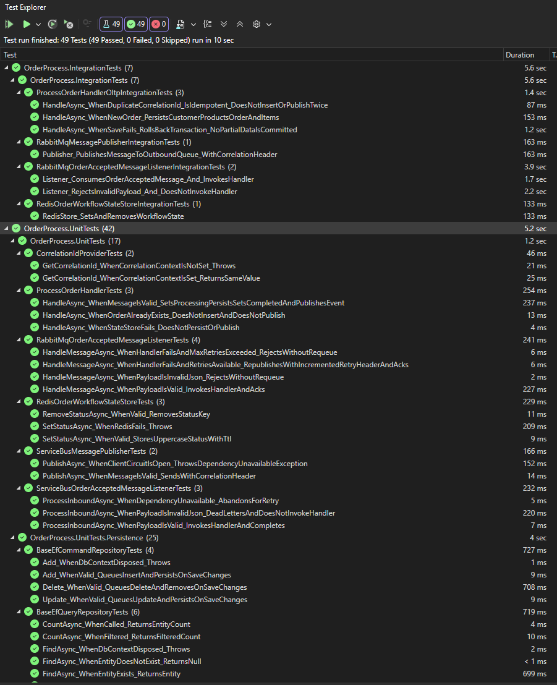

# Order Process Service (`order-process`)

Background worker that **consumes accepted orders**, persists them in SQL (OLTP), updates **transient workflow state** in Redis for real‑time UX, and publishes a completion event for downstream notification delivery.

This service has **no synchronous HTTP business API**. It scales horizontally as a worker.

---

## What this service does

- **Consumes** `OrderAccepted` messages from the inbound FIFO queue (`order.accepted`).
- Executes the **business transaction** that persists the order in SQL (the database generates the business `OrderId`).
- Updates workflow status in Redis (ephemeral, TTL-based):
  - `order:status:{CorrelationId} = PROCESSING`
  - `order:status:{CorrelationId} = COMPLETED`
- **Publishes** `OrderProcessed` to the outbound FIFO queue (`order.processed`) with `{ CorrelationId, OrderId }`.
- Emits logs + traces with **end-to-end correlation**.

What it **does not** do:
- Serve client traffic / expose an external API
- Manage WebSockets or push notifications
- Treat Redis as a system of record

---

## Workflow (end-to-end)

1. **order-accept** publishes **`OrderAccepted`** with a **`CorrelationId` in the message payload**.
2. **order-process** consumes `OrderAccepted`.
3. Sets Redis status to `PROCESSING`.
4. Persists the order inside **one OLTP transaction** (SQL generates `OrderId`).
5. Sets Redis status to `COMPLETED`.
6. Publishes **`OrderProcessed(CorrelationId, OrderId)`**.

---

## Correlation model

Two identifiers are intentionally used:

| Identifier | Source | Purpose |
|---|---|---|
| `CorrelationId` | Generated at intake (`order-accept`) | Workflow correlation, idempotency key, Redis workflow key, logs/traces |
| `OrderId` | Generated by SQL (PK) | Business identity |

### CorrelationId is taken from the payload

At the start of each async hop, the inbound listener **extracts `CorrelationId` from the event payload** (not derived from transport metadata) and stores it in an ambient correlation context so it flows into logs/traces and outbound messages.

---

## Responsibilities

This service is responsible for:

- Subscribing to the `OrderProcessed` FIFO queue and consuming messages asynchronously
- Performing **idempotent** order processing (safe under at-least-once delivery)
- Executing the **OLTP transaction** that persists the order into SQL
- Generating the business `OrderId` **via database-generated primary key**
- Updating transient workflow status in **Redis**:
  - `order:status:{CorrelationId} = PROCESSING`
  - `order:status:{CorrelationId} = COMPLETED`
- Publishing an `OrderProcessed` integration event (includes `CorrelationId` + `OrderId`)
- Emitting logs, traces, and metrics with correlation propagation
- Exposing health endpoints for container orchestration (liveness/readiness)

This service does **not**:

- Accept direct client traffic (no public HTTP API for processing)
- Manage WebSocket connections or push notifications to clients
- Implement authentication/authorization (handled at the gateway edge)
- Use Redis as a system of record

---

## Architectural Role

The Order Process Service is the **persistence and business execution boundary** of the workflow:

- It **owns the relational database schema** for orders (migrations, persistence model, constraints).
- It **converts an accepted request** into a persisted business entity.
- It **emits a completion event** to decouple processing from notification delivery.

This separation allows:

- Fast ingestion (Order Accept returns immediately)
- Ordered, reliable background processing
- Independent scaling of workers vs. API ingress vs. WebSocket servers

---

## DDD & persistence model

The persisted domain model is intentionally small and explicit:

- `Customer`, `Product`, `Order`, `OrderItem`
- Shared persistable base: `EntityBase` (`Id`, `CreatedAt`, `UpdatedAt`, `IsSoftDeleted`)

`Order.CorrelationId` is persisted and enforced as **unique** in the database to support idempotency.

---

## UnitOfWork + Repository (with reusable base classes)

Persistence uses **UnitOfWork + Repository** with CQRS-style separation:

- `IContosoUnitOfWork` is the transaction boundary (`SaveChangesAsync`, `RollbackAsync`)
- Command repositories queue writes; the unit of work commits the transaction
- Query repositories default to safe reads (`AsNoTracking()`)

Reusable EF Core bases:
- `BaseEfCommandRepository<TEntity>`
- `BaseEfQueryRepository<TEntity>`

---

## Idempotency Strategy

Message delivery is **at-least-once**, so duplicates are expected.

The consumer is designed to be **idempotent** by using the `CorrelationId` as the stable workflow key:

- The database enforces a unique constraint on `CorrelationId` (or equivalent lookup strategy).
- On processing:
  - If the order for `CorrelationId` does not exist, insert it and obtain the generated `OrderId`.
  - If it already exists, treat the message as a duplicate and **do not create a second order**.
- The service may safely re-publish `OrderProcessed` for duplicates (downstream consumers must also be defensive).

> FIFO ordering ensures predictable processing order. Idempotency ensures correctness under retries and redelivery.

---

## Persistence (SQL)

This service owns persistence for orders.

### Database Guarantees
- SQL is the **system of record**
- Strong consistency for transactional state
- `OrderId` is generated by the database (identity/sequence PK)

### Transaction Boundary
Processing is executed as an OLTP transaction:

- Validate message and map to persistence model
- Insert (or detect existing order via `CorrelationId`)
- Commit
- Publish completion event

> Outbox is not implemented in this service. The design relies on defensive retries and idempotency to tolerate transient publish failures.

---

## Messaging

### Queues

- **Inbound**: `OrderProcessed` (FIFO)
- **Outbound**: `OrdersProcessed` (FIFO)

### Events

- **Consumed:** `OrderAcceptedEvent(CorrelationId, CreateOrderRequest)`
- **Published:** `OrderProcessedEvent(CorrelationId, OrderId)`

### Delivery semantics & idempotency

Delivery is **at-least-once**, so duplicates are expected.

Idempotency is enforced via the **unique constraint on `Order.CorrelationId`**:

- If `CorrelationId` is new → insert + commit, then publish `OrderProcessed`
- If it already exists → treat as duplicate (do not create a second order)

### Broker Choice

- **Azure Service Bus** in production
- **RabbitMQ** for local development and integration testing

Application code depends on messaging **abstractions**, allowing broker replacement without changing business logic.

### Delivery Semantics

- At-least-once delivery
- Consumers must be idempotent
- Poison messages are isolated via **dead-letter queues (DLQ)** and handled operationally

---

## Integration Event Contracts

This service defines/owns the following integration contracts:

### `OrderProcessed` (consumed)
Represents an order that has been accepted at the API boundary.

**Key fields**
- `CorrelationId`
- Order payload (customer, items, etc.)
- Identity context (claims/subject), if propagated from the gateway

### `OrderProcessed` (published)
Represents a successfully persisted order.

**Key fields**
- `CorrelationId`
- `OrderId` (generated by SQL)

This event is consumed by the Notification service to send the final WebSocket update.

---

## Design and Code Organization

This service follows **Clean Architecture** principles:

- Message handlers depend on abstractions, not infrastructure
- Use cases are isolated from persistence and broker implementations
- Infrastructure concerns (SQL, Redis, messaging) are injected via interfaces

The codebase follows **SOLID** to maximize:
- Testability
- Clear responsibility boundaries
- Maintainability under change

---

## Stateless Design

The Order Process Service is **stateless**:

- No in-memory workflow state
- No reliance on local caches for correctness

State is externalized to:
- SQL (system of record)
- Redis (transient workflow status)

This supports:
- Horizontal scaling
- Safe restarts
- Predictable behavior under load

---

## Security and Authorization

This service does not validate JWTs directly.

Security is enforced at the **API Gateway layer** (Azure API Management), including:

- JWT validation (issuer, audience, signature)
- Rate limiting / quotas
- Traffic protection

If identity context is required during processing, claims may be propagated from upstream messages.
The service treats internal communication as **zero-trust** and validates required fields at boundaries.

---

## Failure Handling and Resilience

This service depends on critical external infrastructure:

- **Message broker** (to consume and publish events)
- **SQL Database** (system of record)
- **Redis** (workflow state for UX / reconnection)

### Applied Policy (Polly)

#### Broker (consumer + publisher)
- Short timeouts per attempt
- Retries with exponential backoff (transient failures only)
- Consumer acknowledges messages **only after** successful processing

#### SQL
- Short command timeouts
- Retries for transient connectivity errors (careful to avoid retrying non-transient failures)
- Transaction scope kept minimal to reduce lock duration

#### Redis
- Short timeouts
- Limited retries on transient errors
- Fail-fast behavior to avoid resource exhaustion during degradation

> If Redis updates fail after retries, the message is retried. Because processing is idempotent, retries are safe.

---

## Observability

### Logging
- Structured logs
- `CorrelationId` is included in log scopes for end-to-end traceability
- Logs are designed for centralized aggregation (e.g., Azure Monitor)

### Telemetry and Tracing
- OpenTelemetry instrumentation
- Correlation propagated across:
  - message headers
  - logs
  - traces

### Operations
- Dead-letter queues are monitored and treated as an operational workflow.
- `CorrelationId` enables end-to-end troubleshooting across services.

---

## Health Checks

This service exposes health endpoints for Kubernetes:

- **Liveness**: process is running
- **Readiness**: worker is ready to consume messages (basic checks)

Health checks should validate service availability (process + basic wiring), and avoid deep dependency checks that may cause restart loops during partial outages.

---

## Testing Strategy

### Unit Tests
Focus on:
- Message handling behavior
- Idempotency logic
- Mapping and validation
- Error handling paths

External dependencies are mocked via abstractions (SQL repository, broker, Redis client).

### Integration Tests
Validate:
- Consumption and publishing contracts (serialization + headers)
- SQL persistence behavior
- Redis state updates
- End-to-end processing of a single `OrderProcessed` message in a local environment
- Error handling and resilience behaviour (policies, dead-lettering, etc.)

Integration tests typically run against:
- Local RabbitMQ
- Local Redis
- A local SQL instance (container or developer database)

Integration tests create a **dedicated SQL database per run** and **drop it at the end of the execution** to keep runs isolated.

---

## Design Philosophy

This service prioritizes:

- Correctness under retries (idempotency)
- Clear transaction boundaries
- Loose coupling via events
- Operational safety and traceability

It is designed to remain simple, predictable, and horizontally scalable.
